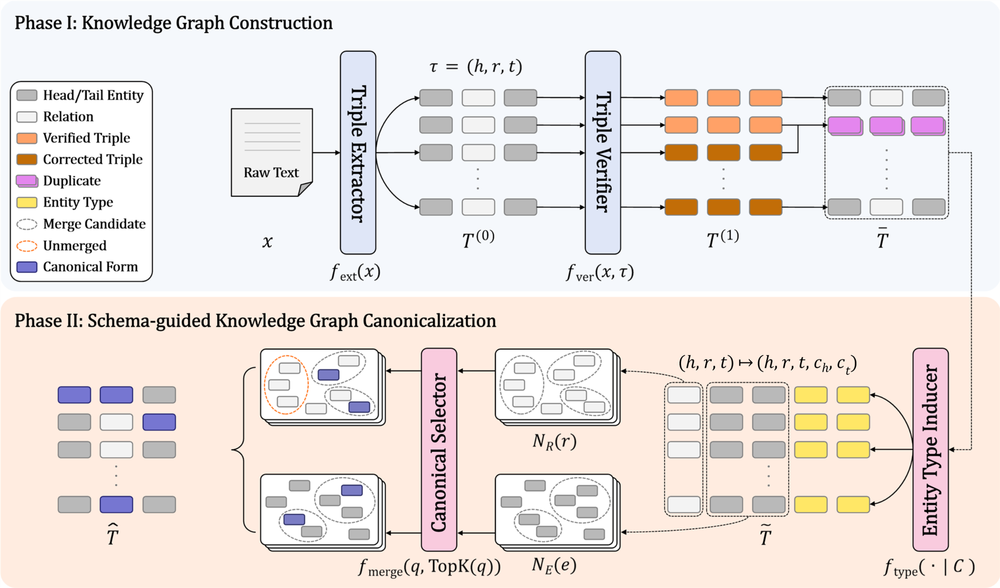

# UniKG: A Unified Framework for Knowledge Graph Construction and Canonicalization with Large Language Models

Official implementation of **"UniKG: A Unified Framework for Knowledge Graph Construction and Canonicalization with Large Language Models"**.

## Paper Figure (Overview)

Add the main figure image at:

- `assets/unikg_overview.png`

Then it will render here:



## Quick Start

From the project root (`/home/UniKG`):

```bash
# (Recommended) create env
conda create -n unikg python=3.10.12
conda activate unikg

# install dependencies
pip install -r requirements.txt
```

After installing requirements, run each pipeline by reading the README in its folder:

- **Construction (extract + refine triples)**: see `construction/README.md`
- **Canonicalization (normalize triples)**: see `canonicalization/README.md`
- **Evaluation (Metrix)**: see `evaluate/README.md`

## Pipelines

### Construction

- **What it does**: Extract triples from articles and refine/verify them.
- **How to run**: follow `construction/README.md`

### Canonicalization

- **What it does**: Canonicalize (normalize/merge) entity/relation surface forms from row-wise triples.
- **How to run**: follow `canonicalization/README.md`

### Evaluation

- **What it does**: Run Metrix metrics (G-BLEU / G-ROUGE / G-BERTScore) against golden triples.
- **How to run**: follow `evaluate/README.md`
