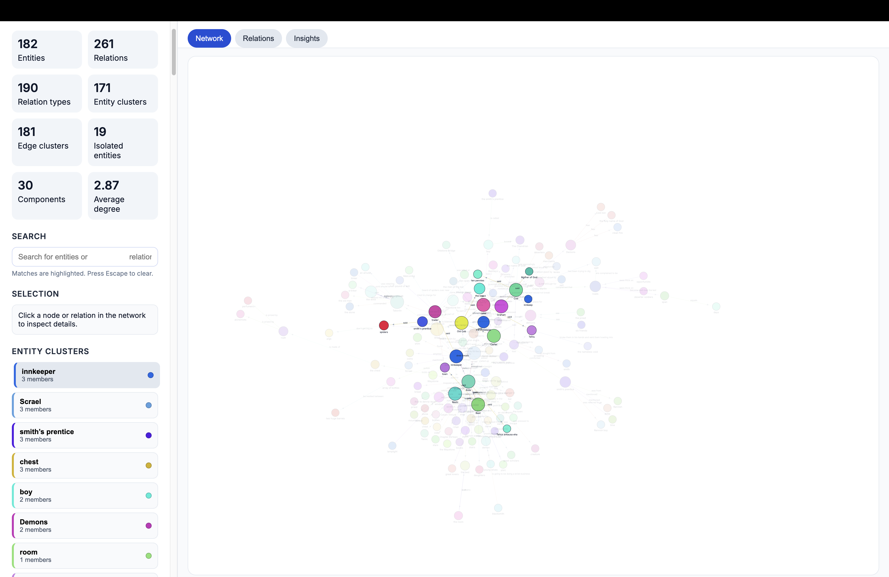

# kg-gen: 모든 텍스트로부터 지식 그래프 생성

📄 [**논문**](https://arxiv.org/abs/2502.09956) | 🐍 [**패키지**](https://pypi.org/project/kg-gen/) | 🤖 [**MCP**](https://github.com/stair-lab/kg-gen/tree/main/mcp/) | 🔬 [**실험**](https://github.com/stair-lab/kg-gen/tree/main/experiments/) | 👩🏻‍💻 [**데이터셋**](https://huggingface.co/datasets/belindamo/wiki_qa_kggen) | 🐦 [**X 업데이트**](https://x.com/belindmo)

> 💡신규! [kg-gen.org](https://kg-gen.org)에서 KGGen 시각화 도구를 사용해 보세요.

환영합니다! `kg-gen`은 AI를 활용해 일반 텍스트에서 지식 그래프를 추출하는 데 도움을 줍니다. 소규모 및 대규모 텍스트 입력 모두 처리 가능하며 대화 형식의 메시지도 다룰 수 있습니다.

지식 그래프를 생성하는 이유는? `kg-gen`은 다음과 같은 경우에 유용합니다:
- RAG(검색 강화 생성)를 지원할 그래프 생성
- 모델 훈련 및 테스트용 그래프 합성 데이터 생성
- 모든 텍스트를 그래프로 구조화
- 원본 텍스트 내 개념 간 관계 분석

[LiteLLM](https://docs.litellm.ai/docs/providers)을 통해 API 기반 및 로컬 모델 공급자를 지원합니다. OpenAI, Ollama, Anthropic, Gemini, Deepseek 등이 포함됩니다. 구조화된 출력 생성을 위해 [DSPy](https://dspy.ai/)도 사용합니다.

- [`tests/`](https://github.com/stair-lab/kg-gen/tree/main/tests) 디렉토리의 스크립트를 실행하여 직접 사용해 보세요.
- KG 벤치마크 MINE 실행 방법은 [`MINE/`](https://github.com/stair-lab/kg-gen/tree/main/experiments/MINE) 디렉토리에 안내되어 있습니다.
- 논문 읽기: [KGGen: 언어 모델을 활용한 일반 텍스트로부터 지식 그래프 추출](https://arxiv.org/abs/2502.09956)

## 원하는 모델로 구동하기

사용할 `model` 문자열을 전달하세요. 모델 호출은 LiteLLM을 통해 라우팅되며, 일반적으로 LiteLLM은 `{model_provider}/{model_name}` 형식을 따릅니다. 구체적인 형식 지정 방법은 [https://docs.litellm.ai/docs/providers](https://docs.litellm.ai/docs/providers)에서 확인하세요.

전달 가능한 모델 예시:
- `openai/gpt-5`
- `gemini/gemini-2.5-flash`
- `ollama_chat/deepseek-r1:14b`

`base_url`로 사용자 지정 API 기본 URL을 지정할 수 있습니다([예시](https://github.com/stair-lab/kg-gen/tree/main/tests/test_custom_api_base.py)).

## 빠른 시작

모듈 설치:
```bash
pip install kg-gen
```

그런 다음 `kg-gen`을 임포트하여 사용합니다. 텍스트 입력은 다음 두 형식 중 하나로 제공할 수 있습니다:
1. 단일 문자열
2. Message 객체 목록 (각 객체는 역할과 내용을 포함)

다음은 몇 가지 예시 스니펫입니다:
```python
from kg_gen import KGGen

# 선택적 구성으로 KGGen 초기화
kg = KGGen(
  model="openai/gpt-4o",  # 기본 모델
  temperature=0.0,        # 기본 온도
  api_key="YOUR_API_KEY"  # 환경 변수에 설정 또는 로컬 모델 사용 시 선택적
)

# 예시 1: 컨텍스트가 포함된 단일 문자열
text_input = "Linda is Josh's mother. Ben is Josh's brother. Andrew is Josh's father."
graph_1 = kg.generate(
  input_data=text_input,
  context="Family relationships"
)
# 출력: 
# entities={'Linda', 'Ben', 'Andrew', 'Josh'} 
# edges={'is brother of', 'is father of', 'is mother of'} 
# relations={('Ben', 'is brother of', 'Josh'), 
#           ('Andrew', 'is father of', 'Josh'), 
#           ('Linda', 'is mother of', 'Josh')}
```


### 지식 그래프 시각화
```python
KGGen.visualize(graph, output_path, open_in_browser=True)
```




### 추가 예시 - 청크 처리, 클러스터링, 메시지 배열 전달 

```python
# 예시 2: 청크 처리 및 클러스터링을 적용한 대용량 텍스트
with open('large_text.txt', 'r') as f:
  large_text = f.read()

# 예시 입력 텍스트:
# """
# 신경망은 기계 학습 모델의 한 유형입니다. 딥 러닝은 신경망의 다중 계층을 사용하는 기계 학습의 하위 집합입니다.
# 지도 학습은 패턴을 학습하기 위해 훈련 데이터가 필요합니다. 기계 학습은 컴퓨터가 데이터로부터 학습할 수 있도록 하는 AI 기술의 한 유형입니다.
# AI(인공 지능)는 더 넓은 인공 지능 분야와 관련이 있습니다.
# 신경망(NN)은 ML 애플리케이션에서 흔히 사용됩니다. 기계 학습(ML)은 많은 연구 분야에 혁명을 일으켰습니다.
# ...
"""
graph_2 = kg.generate(
  input_data=large_text,
  chunk_size=5000,  # 텍스트를 5000자 단위로 처리
  cluster=True      # 유사한 엔티티와 관계를 클러스터링
)
# 출력:
# entities={'신경망', '딥 러닝', '머신 러닝', 'AI', '인공 지능', 
#          '지도 학습', '비지도 학습', '훈련 데이터', ...} 
# edges={'~의 유형이다', '~를 필요로 한다', '~의 하위 집합이다', '~를 사용한다', '~와 관련이 있다', ...} 
# relations={('신경망', '는 유형이다', '기계 학습'), 
#           ('딥 러닝', '는 부분집합이다', '기계 학습'), 
#           ('지도 학습', '는 필요로 한다', '훈련 데이터'), 
#           ('기계 학습', '는 유형이다', 'AI'),
#           ('AI', 'is related to', 'artificial intelligence'), ...}
# entity_clusters={
#   'artificial intelligence': {'AI', 'artificial intelligence'},
#   'machine learning': {'machine learning', 'ML'},
#   'neural networks': {'neural networks', 'neural nets', 'NN'}
#   ...
# }
# edge_clusters={
#   'is type of': {'is type of', 'is a type of', 'is a kind of'},
#   'is related to': {'is related to', 'is connected to', 'is associated with'
#  ...}
# }

# 예시 3: 메시지 배열
messages = [
  {"role": "user", "content": "프랑스의 수도는 어디인가요?"}, 
  {"role": "assistant", "content": "프랑스의 수도는 파리입니다."}
]
graph_3 = kg.generate(input_data=messages)
# 출력:
# entities={'Paris', 'France'}
# edges={'has capital'}
# relations={('France', 'has capital', 'Paris')}

# 예시 4: 여러 그래프 결합하기
text1 = "린다(Linda)는 조(Joe)의 어머니입니다. 벤(Ben)은 조의 형제입니다."

# 입력 텍스트 2: 조(Joe)라고도 불립니다."
text2 = "앤드류(Andrew)는 조셉(Joseph)의 아버지입니다. 주디(Judy)는 앤드류의 여동생입니다. 조셉은 조(Joe)라고도 불립니다."

graph4_a = kg.generate(input_data=text1)
graph4_b = kg.generate(input_data=text2)

# 그래프 결합
combined_graph = kg.aggregate([graph4_a, graph4_b])

# 선택적으로 결합된 그래프 클러스터링
clustered_graph = kg.cluster(
  combined_graph,
  context="가족 관계"
)
# 출력:
# entities={'Linda', 'Ben', 'Andrew', 'Joe', 'Joseph', 'Judy'}
# edges={'is mother of', 'is father of', 'is brother of', 'is sister of'}
# relations={('Linda', 'is mother of', 'Joe'),
#           ('Ben', 'is brother of', 'Joe'),
#           ('Andrew', 'is father of', 'Joe'),
#           ('Judy', 'is sister of', 'Andrew')}
# entity_clusters={
#   'Joe': {'Joe', 'Joseph'},
#   ...
# }
# edge_clusters={ ... }

## 이 저장소에서 설치:

이 저장소를 복제하고 `pip install -e '.[dev]'`를 사용하여 종속성을 설치하세요.

루트 디렉토리에서 `python tests/test_basic.py`를 실행하여 작동 여부를 확인할 수 있습니다. 이 명령은 `tests/test_basic.html`에 멋진 시각화 결과도 생성합니다.

### AI 에이전트를 위한 MCP 서버

지속적 메모리 기능이 필요한 AI 에이전트용:

```bash
# MCP 서버 설치 및 시작
pip install kg-gen
kggen mcp

# Claude Desktop, 커스텀 MCP 클라이언트 또는 기타 AI 애플리케이션과 함께 사용
```

자세한 설정 및 통합 방법은 [MCP 서버 문서](mcp/)를 참조하세요.

## 기능

### 대용량 텍스트 분할 처리
대용량 텍스트의 경우 `chunk_size` 매개변수를 지정하여 텍스트를 작은 단위로 처리할 수 있습니다:
```python
graph = kg.generate(
  input_data=large_text,
  chunk_size=5000  # 5000자 단위로 처리)

```

### 유사한 엔티티 및 관계 클러스터링
생성 중 또는 생성 후 유사한 엔티티와 관계를 클러스터링할 수 있습니다:
```python
# 생성 중
graph = kg.generate(
  input_data=text,
  cluster=True,
  context="클러스터링을 안내할 선택적 컨텍스트"
)

# 또는 생성 후    
clustered_graph = kg.cluster(    
  graph,    
  context="클러스터링을 안내하기 위한 선택적 컨텍스트"    )
    
```

### 여러 그래프 통합하기
aggregate 메서드를 사용하여 여러 그래프를 결합할 수 있습니다:
```python
graph1 = kg.generate(input_data=text1)
graph2 = kg.generate(input_data=text2)
combined_graph = kg.aggregate([graph1, graph2])
```

### 메시지 배열 처리
메시지 배열을 처리할 때 kg-gen은:
1. 각 메시지의 역할 정보를 보존합니다
2. 메시지 순서와 경계를 유지합니다
3. 엔티티와 관계를 추출할 수 있습니다:
   - 메시지에 언급된 개념 간
   - 화자(역할)와 개념 간
   - 대화 내 여러 메시지 간

예를 들어, 다음 대화에서:
```python
messages = [
  {"role": "user", "content": "프랑스의 수도는 어디인가요?"},
  {"role": "assistant", "content": "프랑스의 수도는 파리입니다."}
]
```

생성된 그래프에는 다음과 같은 엔티티가 포함될 수 있습니다:
- "user"
- "assistant"
- " 프랑스"     
- "파리"     

그리고 다음과 같은 관계:     
- (사용자, "에 대해 묻다", "프랑스")     
- (어시스턴트, "진술하다", "파리")     
- (파리, "의 수도이다", "프랑스")     

### 인용하기     
KGGen이 유용하다고 생각되면 다음을 인용해 주시기 바랍니다:     

```     
@misc {mo2025kggenextractingknowledgegraphs, 
      title={KGGen: Extracting Knowledge Graphs from Plain Text with Language Models}, 
      author={Belinda Mo and Kyssen Yu and Joshua Kazdan and Joan Cabezas and Proud Mpala and Lisa Yu and Chris Cundy and Charilaos Kanatsoulis and Sanmi Koyejo}, 
      year= {2025}, 
      eprint={2502.09956}, 
      archivePrefix={arXiv}, 
      primaryClass={cs.CL}, 
      url={https://arxiv.org/abs/2502.09956}, 
} 
``` 
## 라이선스 
MIT 라이선스.
